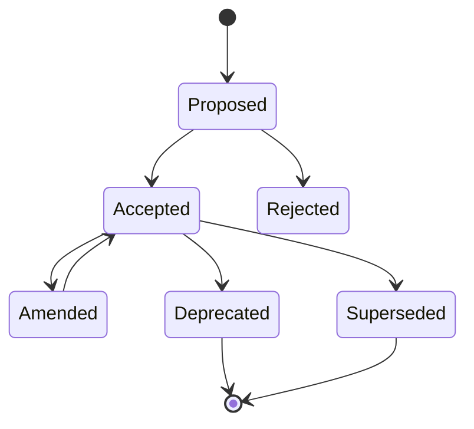

# Architecture Decision Records (ADR)

Las decisiones arquitectónicas son el activo más valioso de un proyecto a largo plazo. Sin registro, cada nueva incorporación al equipo redescubre lo mismo. Los ADRs capturan el qué, el por qué y las consecuencias de cada decisión.

---

## Formato ADR Estándar

Cada ADR es un archivo en `docs/adr/` con el formato `NNNN-title-with-dashes.md`.

```md
# NNNN — Título corto pero descriptivo

**Estado:** [Proposed | Accepted | Deprecated | Superseded | Amended]
**Fecha:** YYYY-MM-DD
**Decisores:** [lista de personas que tomaron la decisión]

## Contexto

Describe el problema o situación que motiva la decisión. Incluye:
- Restricciones técnicas o de negocio
- Alternativas consideradas brevemente
- Por qué el status quo no es aceptable
- Enlaces a ADRs relacionados

## Decisión

La decisión que se tomó. Debe ser específica, no genérica.

> Adoptamos Prisma como ORM para la capa de infra, con esquemas separados
> por schema de base de datos Postgres, mapeando cada feature a un schema.

## Consecuencias

Lo que cambia a partir de esta decisión:

- **Positivas:**
  - Type-safe queries sin runtime validation
  - Migraciones automáticas con `prisma migrate`
  - Schemas por feature como primer paso hacia microservicios
- **Negativas:**
  - Vendor lock-in con Prisma (cambiar de ORM requiere reescribir repos)
  - Migraciones lentas en bases de datos con millones de registros
  - Dependencia de `prisma generate` como paso de build
- **Neutrales:**
  - El equipo necesita aprender Prisma (curva de 1-2 semanas)
```

---

## Variantes

### ADR Completo (recomendado para decisiones fundacionales)

Incluye Contexto + Decisión + Consecuencias + Alternativas evaluadas.

```md
## Alternativas Consideradas

| Alternativa | Pros | Contras | Veredicto |
|---|---|---|---|
| TypeORM | Maduro, Decorators | Performance pobre en joins complejos | ❌ |
| Drizzle | SQL-like, sin decorators | Ecosistema más pequeño | ❌ |
| Prisma | Type-safe, Migraciones, Schemas | Vendor lock-in, generate step | ✅ |
```

### ADR Ligero (para decisiones tácticas)

```md
# 0012 — Usar tRPC para endpoints internos

**Estado:** Accepted
**Fecha:** 2026-05-10

**Contexto:** Los endpoints entre features dentro del monolith
necesitan type-safety sin overhead de serialización REST.

**Decisión:** Los endpoints internos en platform/http usarán tRPC.
Los endpoints públicos siguen siendo REST con OpenAPI.

**Consecuencias:** Type-safety extremo entre features pero
acoplamiento a tRPC en la capa de plataforma.
```

### ADR de Excepción (para decisiones que violan una regla de Forge)

```md
# 0023 — Ignorar R1 temporalmente en ReportEngine

**Estado:** Accepted
**Fecha:** 2026-06-15
**Expira:** 2026-09-15

**Contexto:** ReportEngine necesita acceso directo a datos de infra
para generar reportes en tiempo real. Extraer a servicio separado
requiere 3 sprints.

**Decisión:** Se permite `feature/reports → infra/prisma` como
excepción temporal, documentada en ADR y con `forge-ignore: R1`
en los imports afectados.

**Consecuencias:** Degradación arquitectónica controlada.
Se revertirá antes de la expiración.
```

---

## Estados de un ADR



| Estado | Significado |
|---|---|
| **Proposed** | Propuesto, en discusión |
| **Accepted** | Aprobado e implementado |
| **Rejected** | Descartado, se preserva para no repetir |
| **Deprecated** | Ya no se aplica, pero sigue vigente para sistemas existentes |
| **Superseded** | Reemplazado por otro ADR |
| **Amended** | Modificado parcialmente, el ADR original + amendment |

---

## Integración con Forge

### ADRs y ARCHITECTURE.md

`forge inscribe` debe incluir en ARCHITECTURE.md:

```md
## Architecture Decision Records

| ADR | Título | Estado | Fecha |
|---|---|---|---|
| 0001 | Adoptar Prisma como ORM | Accepted | 2025-12-01 |
| 0002 | Schemas separados por feature | Accepted | 2025-12-10 |
| 0003 | Event Bus asíncrono con RabbitMQ | Proposed | 2026-01-15 |
| 0004 | Feature Splits de Catalog a Search | Superseded por 0007 | 2026-02-01 |
```

### ADRs y `forge assay`

El ensayo multi-persona (`assay`) debe considerar ADRs como fuente de información:

- **Bezos**: evalúa si la decisión es reversible o irreversible
- **Fowler**: evalúa la evolución de la decisión en el tiempo
- **Arquitecta Senior**: evalúa consistencia con el modelo arquitectónico

### ADRs y reglas inline ignore

Cuando se usa `forge-ignore` para excepcionar una regla, debe referenciar el ADR que la autoriza:

```ts
// forge-ignore: R1 — ver ADR-0023
import { PrismaClient } from "../../infra/prisma/client";
```

### ADRs y `forge quench`

`forge quench` debe verificar que:
- Los ADRs aceptados tienen su decisión implementada
- Los ADRs con expiración no han vencido sin renovación
- No hay `forge-ignore` sin ADR asociado

---

## Cuándo escribir un ADR

| Situación | Ejemplo | ADR necesario |
|---|---|---|
| Decisión fundacional | Framework, ORM, BD, message broker | ✅ Obligatorio |
| Patrón arquitectónico | CQRS, Event Sourcing, Sagas | ✅ Recomendado |
| Cambio de regla de Forge | Ignorar R8 entre dos features | ✅ Obligatorio |
| Tecnología nueva | Adoptar Redis, Elasticsearch | ✅ Recomendado |
| Estándar de equipo | Formato de commits, naming conventions | ✅ Ligero |
| Excepción temporal | Ignorar R1 por 3 sprints | ✅ Obligatorio |
| Cambio de provider | Migrar de AWS a GCP | ✅ Obligatorio |
| Refactor mayor | Extraer Catalog como microservicio | ✅ Obligatorio |
| Dependencia externa | Adoptar librería X | ⚠️ Si tiene impacto arquitectónico |
| Bugfix complejo | Cambio en algoritmo de pricing | ❌ |

---

## Estructura de directorios

```
docs/
  adr/
    0001-adopt-prisma-orm.md
    0002-separate-schemas-per-feature.md
    0003-event-bus-rabbitmq.md
    README.md           ← index de ADRs activos
```

El `README.md` se genera automáticamente listando los ADRs activos:

```bash
# {{AGENT_PATH}}/scripts/forge-adr.mjs (futuro)
node {{AGENT_PATH}}/scripts/forge-adr.mjs list    # lista todos los ADRs
node {{AGENT_PATH}}/scripts/forge-adr.mjs new     # crea nuevo ADR desde template
node {{AGENT_PATH}}/scripts/forge-adr.mjs status  # cambia estado de un ADR
```

---

## Anti-patrones

| Anti-patrón | Problema | Solución |
|---|---|---|
| **ADR sin contexto** | "Usamos Prisma". Sin por qué ni alternativas. | Incluir motivación y alternativas consideradas siempre. |
| **ADR sin consecuencia** | "Adoptamos Kafka" sin decir el costo operativo. | Documentar consecuencias positivas, negativas y neutrales. |
| **ADRs que nadie lee** | Se escriben y se archivan. Nadie los consulta. | Integrar en `forge inscribe`. Mencionar en code review cuando aplica. |
| **ADR sobre tecnología obvia** | "Usamos TypeScript" como ADR. | No todo es ADR. Si no hay trade-off significativo, no es ADR. |
| **ADR sin fecha** | No se sabe cuándo se tomó ni si sigue vigente. | Fecha obligatoria. Estados para ciclo de vida. |
| **Demasiados ADRs** | Cada PR tiene un ADR. Se deja de leer. | Solo decisiones con impacto arquitectónico. No para implementación cotidiana. |

---

## Conexión con Forge

| Comando | Acción |
|---|---|
| `forge inscribe` | Incluye ADRs activos en ARCHITECTURE.md |
| `forge assay` | Usa ADRs como insumo para el ensayo multi-persona |
| `forge quench` | Verifica que ADRs aceptados están implementados |
| `forge inspect` | Reporta ADRs vencidos o sin implementar |
| `forge reforge` | Sugiere crear ADR cuando se detecta un cambio arquitectónico |

## Ver también

- `reference/evolutionary-architecture.md` — fitness functions que los ADRs registran
- `reference/principles.md` — principios que los ADRs documentan como decisiones
