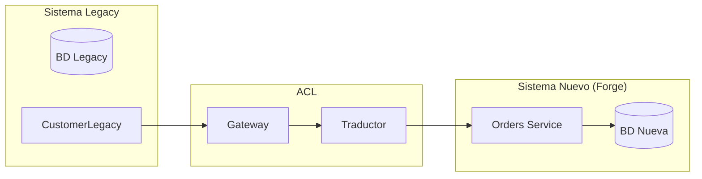

# Anti-Corruption Layer (ACL)

Cuando un bounded context debe integrarse con otro que tiene un modelo distinto (especialmente legacy o externo), la ACL es la capa que traduce sin contaminar.

---

## Definición y Propósito

Una **Anti-Corruption Layer** es un mecanismo de traducción entre dos bounded contexts. Su función es evitar que el modelo de un sistema externo (o legacy) "corrompa" el modelo de dominio del sistema nuevo.



**Cuándo usar ACL:**
- Integración con un sistema legacy que no puede modificarse (SAP, Salesforce, mainframe)
- Integración con un servicio externo cuyo modelo no controlas (API de terceros)
- Migración incremental donde ambos sistemas coexisten (Strangler Fig)
- Dos bounded contexts que evolucionan con ritmos distintos pero necesitan comunicarse

**Cuándo NO usar ACL:**
- El sistema externo expone un Published Language estable (usa el contrato directamente)
- El modelo externo es idéntico o trivialmente mapeable (un mapper simple basta)
- La integración es temporal y el sistema externo será reemplazado pronto

---

## Estructura de una ACL

La ACL vive en `adapter/out/` de la feature que necesita protegerse:

```
src/features/orders/
  domain/
    entities/
      OrderEntity.ts
      CustomerEntity.ts          ← modelo limpio
    repositories/
      ICustomerRepository.ts     ← puerto que la ACL implementa
  adapters/
    out/
      legacy-crm/
        CustomerGateway.ts       ← llama al sistema legacy
        CustomerTranslator.ts    ← traduce del modelo legacy al dominio
        CustomerACL.ts           ← facade que combina gateway + translator
      persistence/
        PostgresCustomerRepository.ts  ← implementación normal
```

### Componentes de la ACL

| Componente | Responsabilidad |
|---|---|
| **Gateway** | Comunicación con el sistema externo (HTTP, SOAP, archivos, BD) |
| **Translator** | Mapeo del modelo externo al modelo de dominio y viceversa |
| **Facade** | Orquesta gateway + translator. Implementa la interfaz del puerto. |
| **Contract** | DTOs del modelo externo (viven en la ACL, no contaminan el dominio) |

---

## Implementación

### 1. Definir el puerto (dominio)

```ts
// src/features/orders/domain/repositories/ICustomerRepository.ts
export interface ICustomerRepository {
  findById(id: string): Promise<CustomerEntity | null>;
  findByEmail(email: string): Promise<CustomerEntity | null>;
}
```

### 2. Gateway (comunicación con externo)

```ts
// src/features/orders/adapters/out/legacy-crm/CustomerGateway.ts
// Este archivo es infra y puede depender de HTTP clients, SOAP, etc.

import { LegacyCustomerDTO } from "./LegacyCustomerDTO";

export class LegacyCRMGateway {
  private readonly baseUrl: string;

  constructor(baseUrl: string) {
    this.baseUrl = baseUrl;
  }

  async fetchCustomer(crmId: string): Promise<LegacyCustomerDTO> {
    const response = await fetch(`${this.baseUrl}/api/customers/${crmId}`, {
      headers: { Authorization: `Bearer ${this.apiKey}` },
    });
    if (!response.ok) throw new Error(`CRM error: ${response.statusText}`);
    return response.json();
  }
}
```

### 3. Translator (traducción)

```ts
// src/features/orders/adapters/out/legacy-crm/CustomerTranslator.ts
// Este archivo es PURO. No depende de infraestructura. Solo transforma datos.

import { LegacyCustomerDTO } from "./LegacyCustomerDTO";
import { CustomerEntity } from "../../../domain/entities/CustomerEntity";

export class CustomerTranslator {
  toDomain(dto: LegacyCustomerDTO): CustomerEntity {
    return new CustomerEntity({
      id: dto.customerId,
      name: `${dto.firstName} ${dto.lastName}`,
      email: dto.emailAddress,
      status: this.mapStatus(dto.active),
      createdAt: new Date(dto.registrationDate),
    });
  }

  private mapStatus(legacyActive: boolean): "active" | "inactive" {
    return legacyActive ? "active" : "inactive";
  }
}
```

### 4. Facade ACL (implementación del puerto)

```ts
// src/features/orders/adapters/out/legacy-crm/CustomerACL.ts
// Implementa ICustomerRepository traduciendo desde el CRM legacy.

import { ICustomerRepository } from "../../../domain/repositories/ICustomerRepository";
import { CustomerEntity } from "../../../domain/entities/CustomerEntity";
import { LegacyCRMGateway } from "./CustomerGateway";
import { CustomerTranslator } from "./CustomerTranslator";

export class LegacyCRMRepository implements ICustomerRepository {
  constructor(
    private readonly gateway: LegacyCRMGateway,
    private readonly translator: CustomerTranslator,
  ) {}

  async findById(id: string): Promise<CustomerEntity | null> {
    try {
      const dto = await this.gateway.fetchCustomer(id);
      return this.translator.toDomain(dto);
    } catch (error) {
      // El gateway lanza errores técnicos. La ACL traduce a errores de dominio.
      if (error.message.includes("404")) return null;
      throw new Error("CustomerRepository.fetchFailed");
    }
  }

  async findByEmail(email: string): Promise<CustomerEntity | null> {
    // Si el CRM legacy no soporta búsqueda por email, la ACL puede:
    // 1. Obtener todos los clientes y filtrar (ineficiente)
    // 2. Cachear localmente y buscar en caché
    // 3. Fallar con error explícito
    throw new Error("CustomerRepository.methodNotSupported");
  }
}
```

### 5. Registro en DI

```ts
// En la composición root (platform/di/container.ts)
container.registerSingleton<ICustomerRepository>("ICustomerRepository", {
  useClass: process.env.USE_LEGACY_CRM === "true"
    ? LegacyCRMRepository   // ACL
    : PostgresCustomerRepository,  // implementación nativa
});
```

La DI permite switchear entre legacy y nativo sin cambiar el caso de uso.

---

## Strangler Fig Pattern

El Strangler Fig permite migrar de un sistema legacy a uno nuevo incrementalmente, usando ACL como fachada.

### Fase 1: ACL intercepta todo

```
[API Gateway] → [ACL] → [Legacy CRM]
```

Todas las llamadas pasan por la ACL que habla con el legacy.

### Fase 2: Rutas individuales migradas

```ts
// La ACL decide por ruta/característica si va al legacy o al nuevo
export class CustomerRouterACL implements ICustomerRepository {
  constructor(
    private readonly legacy: LegacyCRMRepository,
    private readonly newRepo: PostgresCustomerRepository,
    private readonly migrationFlag: FeatureFlagService,
  ) {}

  async findById(id: string): Promise<CustomerEntity | null> {
    if (this.migrationFlag.isEnabled("customer-read")) {
      return await this.newRepo.findById(id);
    }
    return await this.legacy.findById(id);
  }
}
```

### Fase 3: Legacy retirado

```
[API Gateway] → [PostgresCustomerRepository]
```

La ACL ya no es necesaria. Se elimina el gateway, el translator y la facade.

### Reglas para Strangler Fig exitoso

1. **Un feature completo se migra a la vez**, no funciones sueltas
2. **La ACL nunca modifica el legacy**. Solo lee y traduce
3. **Feature flags** para activar/desactivar rutas migradas
4. **Métricas de comparación**: response time, error rate, data consistency entre legacy y nuevo
5. **Rollback plan**: desactivar el feature flag vuelve al legacy instantáneamente

---

## Conexión con el Modelo de Forge

### Reglas de dependencia y ACL

| Regla | Relación con ACL |
|---|---|
| **R1** (feature → infra) | La ACL está en `adapter/out/` y accede a infra (el gateway). Está permitido porque el adapter es el puerto de salida. El dominio nunca ve infra. |
| **R7** (infra → feature) | El gateway externo llama a la ACL (infra → adapter). No viola R7 porque el adapter recibe la llamada y la traduce al dominio. |
| **R8** (cross-feature) | Si la ACL se comunica con otra feature de Forge, debe hacerlo mediante eventos o contratos en shared/, no con imports directos. |

### La ACL en la arquitectura de 4 capas

```
┌─────────────────────────────────────────────────┐
│  features/orders/                                │
│    domain/               ← modelo protegido        │
│      CustomerEntity                              │
│      ICustomerRepository ← puerto                 │
│    adapters/out/                                 │
│      legacy-crm/          ← ACL completa          │
│        CustomerGateway    ← infra (llama externo) │
│        CustomerTranslator ← pure translation      │
│        CustomerACL        ← facade                │
│      persistence/                                 │
│        PostgresCustomerRepository                │
└─────────────────────────────────────────────────┘
            │
            ▼  (gateway)
┌──────────────────────┐
│  CRM Legacy (externo) │
│  /api/customers/:id   │
└──────────────────────┘
```

### Dónde NO poner la ACL

| Ubicación incorrecta | Problema |
|---|---|
| `src/shared/acl/` | La ACL es específica de un feature, no compartida. Cada feature tiene su propia ACL. |
| `src/infra/` | La ACL no es infraestructura genérica. Pertenece al adapter del feature. |
| `src/platform/` | Platform no debe saber qué sistemas externos existen. |

---

## Anti-patrones

| Anti-patrón | Problema | Solución |
|---|---|---|
| **Leaky Abstraction** | La ACL pasa DTOs del sistema externo en vez de traducir. El dominio termina dependiendo del modelo legacy. | El Translator debe mapear TODOS los campos. Si falta uno, el dominio no sabe que existe. |
| **Pasamanos (passthrough)** | La ACL no traduce nada. Solo delega. Es una capa que añade complejidad sin valor. | Si no hay traducción que hacer, no uses ACL. Usa el contrato directamente. |
| **ACL que escribe en el legacy** | La ACL muta el sistema externo para "facilitar" la integración. | La ACL solo traduce. Si necesitas escribir, el legacy debe exponer API de escritura. |
| **ACL compartida** | Una sola ACL para todos los features. | Cada feature tiene su propia ACL adaptada a su modelo de dominio. |
| **Gateway sin timeout** | Una llamada al legacy lenta bloquea todo el feature. | Timeouts, circuit breakers y fallbacks obligatorios en el gateway. |
| **ACL sin test** | No se puede verificar que la traducción es correcta. | Tests unitarios del Translator + tests de integración del Gateway. |

### Testing de ACL

```ts
// Test unitario del Translator (puro, sin infraestructura)
describe("CustomerTranslator", () => {
  it("traduce LegacyCustomerDTO a CustomerEntity", () => {
    const dto: LegacyCustomerDTO = {
      customerId: "123",
      firstName: "John",
      lastName: "Doe",
      emailAddress: "john@example.com",
      active: true,
      registrationDate: "2024-01-15T10:00:00Z",
    };
    const result = new CustomerTranslator().toDomain(dto);
    expect(result.id).toBe("123");
    expect(result.status).toBe("active");
  });

  it("mapea active=false a status=inactive", () => {
    const dto = { ...baseDTO, active: false };
    const result = new CustomerTranslator().toDomain(dto);
    expect(result.status).toBe("inactive");
  });
});
```

---

## Conexión con Forge

| Comando | Acción |
|---|---|
| `forge cast` | Durante el shape de la feature, detectar si necesita ACL |
| `forge inspect` | Detecta patrones que indican necesidad de ACL (imports directos a infra externa) |
| `forge relocate` | Puede generar ACL automática al migrar un feature desde legacy |
| `forge reforge` | Sugiere introducir ACL cuando detecta leaky abstractions |

## Ver también

- `reference/bounded-contexts.md` — contexts que la ACL aísla
- `reference/modular-monolith.md` — migración con ACL entre módulos
- `reference/relocate.md` — uso de ACL durante migración legacy
