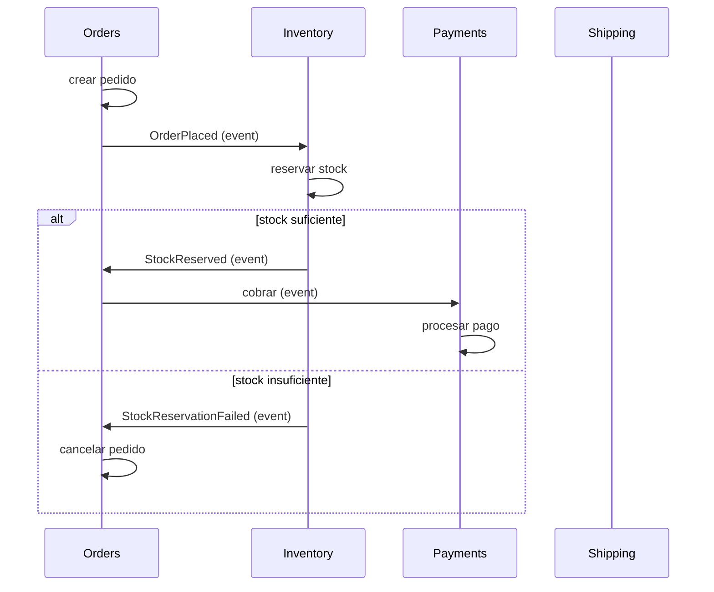
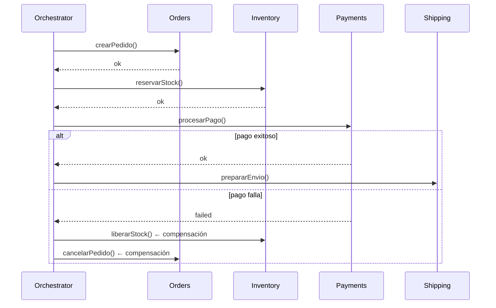

# Sagas — Transacciones Multi-Feature

Los procesos de negocio rara vez caben en una sola feature. Una saga coordina múltiples pasos a través de bounded contexts, garantizando consistencia eventual sin ACID distribuido.

---

## El Problema

Una transacción como "realizar un pedido" cruza múltiples features:

```
Orders: crear pedido → Inventory: reservar stock → Payments: cobrar → Shipping: preparar envío
```

En un monolith con una sola BD, esto sería una transacción ACID. Cuando cada feature tiene su propio schema o BD, no hay transacción distribuida. Las sagas resuelven este problema.

### Una saga no es:
- Una transacción ACID (no hay rollback, hay compensación)
- Un workflow BPMN con motor externo (aunque puede parecerse)
- Un event pipeline unidireccional (tiene lógica de decisión)

### Una saga es:
- Una secuencia de transacciones locales
- Cada paso tiene una acción compensatoria si falla
- La saga completa tiene consistencia eventual garantizada

---

## Coreografía (Choreography)

Cada participante publica eventos y reacciona a eventos de otros. No hay coordinador central.



### Implementación coreografía

```ts
// Cada feature publica y escucha eventos
// features/orders/adapters/in/events/OrderSaga.ts
export class OrderSaga {
  constructor(
    private readonly orderRepo: IOrderRepository,
    private readonly eventBus: IEventBus,
  ) {
    // Escucha respuestas de otros features
    this.eventBus.subscribe("StockReserved", this.onStockReserved.bind(this));
    this.eventBus.subscribe("StockReservationFailed", this.onStockFailed.bind(this));
    this.eventBus.subscribe("PaymentProcessed", this.onPaymentProcessed.bind(this));
    this.eventBus.subscribe("PaymentFailed", this.onPaymentFailed.bind(this));
  }

  async onStockReserved(event: StockReservedEvent): Promise<void> {
    await this.orderRepo.updateStatus(event.orderId, "stock_reserved");
    this.eventBus.publish(new RequestPaymentCommand(event.orderId, event.amount));
  }

  async onStockFailed(event: StockReservationFailedEvent): Promise<void> {
    await this.orderRepo.updateStatus(event.orderId, "cancelled_no_stock");
    // No hay compensación adicional: el pedido nunca se confirmó
  }

  async onPaymentProcessed(event: PaymentProcessedEvent): Promise<void> {
    await this.orderRepo.updateStatus(event.orderId, "paid");
    this.eventBus.publish(new RequestShippingCommand(event.orderId));
  }

  async onPaymentFailed(event: PaymentFailedEvent): Promise<void> {
    await this.orderRepo.updateStatus(event.orderId, "payment_failed");
    // Compensación: liberar stock
    this.eventBus.publish(new ReleaseStockCommand(event.orderId));
  }
}
```

### Pros y contras

| Pro | Contra |
|---|---|
| Sin punto central de fallo | Lógica de saga distribuida: difícil de entender el flujo completo |
| Cada feature es autónomo | Seguimiento complejo (¿en qué paso está cada pedido?) |
| Fácil de añadir nuevos participantes | Riesgo de ciclos de eventos |
| Escala horizontalmente | Testing de integración más complejo |

---

## Orquestación (Orchestration)

Un coordinador central (orchestrator) dirige cada paso y decide el flujo.



### Implementación orquestación

El orchestrator es un feature independiente:

```
src/features/checkout-saga/
  domain/
    SagaInstance.entity.ts      ← estado de cada saga activa
    ISagaStepExecutor.ts         ← interfaz para ejecutar pasos
  application/
    use-cases/
      ExecuteCheckoutSaga.ts     ← orquesta la saga
  adapters/
    out/
      saga-steps/
        CreateOrderStep.ts       ← llama a Orders
        ReserveStockStep.ts      ← llama a Inventory
        ProcessPaymentStep.ts    ← llama a Payments
        PrepareShippingStep.ts   ← llama a Shipping
        CancelOrderStep.ts       ← compensación de Orders
        ReleaseStockStep.ts      ← compensación de Inventory
```

```ts
// features/checkout-saga/application/use-cases/ExecuteCheckoutSaga.ts
export class ExecuteCheckoutSaga {
  constructor(
    private readonly sagaRepo: ISagaInstanceRepository,
    private readonly stepFactory: SagaStepFactory,
  ) {}

  async execute(command: StartCheckoutCommand): Promise<void> {
    const saga = SagaInstance.start("CHECKOUT", {
      orderId: command.orderId,
      customerId: command.customerId,
      items: command.items,
    });

    const steps = [
      this.stepFactory.createOrderStep(),
      this.stepFactory.reserveStockStep(),
      this.stepFactory.processPaymentStep(),
      this.stepFactory.prepareShippingStep(),
    ];

    for (const step of steps) {
      try {
        await step.execute(saga.context);
        saga.advance(step.name);
        await this.sagaRepo.save(saga);
      } catch (error) {
        saga.fail(step.name, error.message);
        await this.compensate(saga, steps);
        return;
      }
    }

    saga.complete();
    await this.sagaRepo.save(saga);
  }

  private async compensate(saga: SagaInstance, steps: SagaStep[]): Promise<void> {
    // Ejecuta compensaciones en orden inverso
    const executedSteps = steps.slice(0, saga.currentStepIndex);
    for (const step of executedSteps.reverse()) {
      try {
        await step.compensate(saga.context);
      } catch (err) {
        // La compensación falló — requiere intervención manual
        saga.requireManualIntervention();
      }
    }
  }
}
```

### Pros y contras

| Pro | Contra |
|---|---|
| Flujo completo visible en un lugar | Punto central de fallo |
| Fácil de testear el orchestrator | El orchestrator conoce todos los participantes |
| Compensaciones explícitas y centralizadas | Riesgo de orchestrator con lógica de negocio |
| Trazabilidad: cada saga tiene estado | Más boilerplate que coreografía |

---

## Cuándo Elegir Cada Una

| Situación | Recomendación |
|---|---|
| 2-3 features, flujo simple | Coreografía |
| 4+ features, flujo con ramas | Orquestación |
| Equipos autónomos que no quieren coordinar | Coreografía |
| Requisito de trazabilidad y monitoreo | Orquestación |
| Flujo con muchas compensaciones | Orquestación |
| Feature nuevo que se suma al flujo existente | Coreografía (solo escucha/publica) |

---

## Manejo de Fallos

### Retry con Backoff

```ts
export class RetryPolicy {
  constructor(
    private readonly maxRetries: number = 3,
    private readonly baseDelay: number = 100,
  ) {}

  async execute<T>(fn: () => Promise<T>): Promise<T> {
    for (let attempt = 1; attempt <= this.maxRetries; attempt++) {
      try {
        return await fn();
      } catch (error) {
        if (attempt === this.maxRetries) throw error;
        const delay = this.baseDelay * Math.pow(2, attempt - 1);
        await new Promise((resolve) => setTimeout(resolve, delay));
      }
    }
  }
}
```

### Dead Letter Queue (DLQ)

Cuando una saga no puede completarse ni compensarse después de N reintentos:

```ts
if (saga.retryCount >= 5) {
  saga.sendToDLQ({
    reason: "Payment service unavailable after 5 retries",
    context: saga.context,
    lastError: error.message,
  });
  // Requiere intervención humana
  await this.sagaRepo.markFailed(saga);
  await this.notificationService.alertOperations(
    `Saga ${saga.id} requiere intervención manual`
  );
}
```

### Fallback Humano

Para casos donde la compensación automática no es posible (ej. un pago ya procesado que no puede revertirse automáticamente):

```ts
if (error.name === "IrreversibleError") {
  saga.requireManualIntervention({
    reason: "Payment already captured, manual refund required",
    instructions: `Login to payment dashboard, refund transaction ${event.paymentId}, then resume saga ${saga.id}`,
    severity: "HIGH",
  });
}
```

---

## Conexión con el Modelo de Forge

### Reglas y Sagas

| Regla | Aplicación |
|---|---|
| **R8** (no cross-feature imports) | La saga se comunica con features mediante eventos o interfaces. Nunca importa directamente. |
| **R5** (domain → infra) | La saga opera en application/use-cases/. No hay infra en dominio de saga. |
| **R9** (no ciclos) | Las sagas coreografiadas deben auditarse para evitar ciclos de eventos (A→B→C→A). |

### Ubicación de la saga en la arquitectura

```
src/features/
  checkout-saga/                ← orchestrator como feature
    domain/
      SagaInstance.entity.ts
      ISagaStepExecutor.ts
    application/
      use-cases/
        ExecuteCheckoutSaga.ts
    adapters/
      out/
        saga-steps/
          CreateOrderStep.ts    ← llama a contracts de Orders
          ReserveStockStep.ts   ← llama a contracts de Inventory
          ProcessPaymentStep.ts ← llama a contracts de Payments
        saga-persistence/
          PostgresSagaRepository.ts
  orders/
    adapters/
      in/
        events/                  ← escucha eventos de la saga
        http/
          commands/              ← la saga llama aquí via contract
```

---

## Anti-patrones

| Anti-patrón | Problema | Solución |
|---|---|---|
| **Saga sin compensación** | Un paso falla y el sistema queda inconsistente. | Cada paso debe tener compensación definida explícitamente. |
| **Orchestrator con lógica de negocio** | El orchestrator decide descuentos, valida reglas, calcula montos. | El orchestrator solo coordina. La lógica de negocio vive en los use cases de cada feature. |
| **Coreografía sin trazabilidad** | Múltiples eventos volando, nadie sabe el estado global de un proceso. | Usar saga log + event store. Monitorear con `forge chain`. |
| **Timeout único** | Todas las operaciones tienen el mismo timeout. Operaciones lentas (pagos) fallan donde rápidas (stock) no. | Timeout configurable por paso de saga. |
| **Compensación que falla sin alerta** | La compensación falla silenciosamente. El sistema cree que compensó pero no lo hizo. | Alertas de operaciones para compensaciones fallidas. Siempre. |
| **Saga como transacción ACID** | Se intenta revertir un paso que ya tuvo efectos visibles para el usuario. | Las sagas ofrecen consistencia eventual. Los efectos visibles deben diseñarse para ser reversibles (o aceptar que no lo son). |

---

## Conexión con Forge

| Comando | Acción |
|---|---|
| `forge cast checkout-saga` | Crea feature orchestrator con estructura de saga |
| `forge inspect` | Detecta features que se comunican sincrónicamente (candidatos a saga) |
| `forge graph` | Visualiza el flujo de la saga como grafo de dependencias entre features |
| `forge chain` | Verifica que la saga no introduce ciclos (R9) |
| `forge assay` | Evalúa si la estrategia de coordinación (coreografía vs orquestación) es la adecuada |

## Ver también

- `reference/bounded-contexts.md` — contexts que la saga coordina
- `reference/events.md` — eventos como unidad de la saga
- `reference/cqrs.md` — commands como pasos de la saga
- `reference/transactional-outbox.md` — entrega confiable de eventos de saga
- `reference/idempotency.md` — retry seguro de pasos de saga
