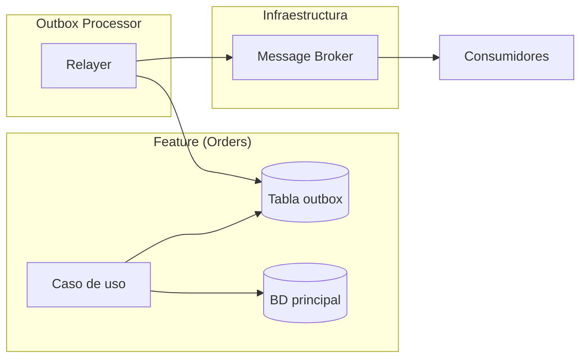

# Transactional Outbox — Entrega Confiable de Eventos

Publicar un evento y escribir en la BD en la misma operación atómica es un problema conocido como **dual-write**. Sin un mecanismo explícito, el sistema puede terminar con datos escritos sin evento publicado, o evento publicado sin datos escritos. El outbox pattern resuelve esto.

---

## El Problema del Dual-Write

```ts
// ❌ Sin outbox: race condition
async function placeOrder(command: PlaceOrderCommand): Promise<void> {
  await this.orderRepo.save(order);         // 1. Escribe en BD
  await this.eventBus.publish(event);        // 2. Publica evento
  // Si el paso 2 falla, el pedido existe pero nadie lo sabe
  // Si el paso 1 falla después del paso 2, hay un evento huérfano
}
```

**Escenarios de fallo:**
- BD commit exitoso, broker caído → evento perdido
- BD commit lento, timeout del cliente → retry → pedido duplicado
- Broker recibe evento, BD falla → evento fantasma

---

## El Patrón Outbox

### Cómo funciona

1. **Escribir en la BD**: la operación de negocio + el evento se guardan en la misma transacción
2. **Relayer**: un proceso independiente lee la tabla outbox y publica los eventos al broker
3. **Eliminar**: una vez publicado exitosamente, el evento se elimina o marca como enviado



### Tabla outbox

```sql
CREATE TABLE IF NOT EXISTS public.outbox (
  id            UUID PRIMARY KEY DEFAULT gen_random_uuid(),
  event_type    VARCHAR(255) NOT NULL,
  aggregate_id  VARCHAR(255) NOT NULL,        -- ID de la entidad que originó el evento
  aggregate_type VARCHAR(255) NOT NULL,       -- tipo de entidad
  payload       JSONB NOT NULL,               -- datos del evento
  occurred_at   TIMESTAMPTZ NOT NULL DEFAULT NOW(),
  processed_at  TIMESTAMPTZ,                  -- NULL = no procesado
  retry_count   INT NOT NULL DEFAULT 0,
  last_error    TEXT
);

CREATE INDEX idx_outbox_unprocessed ON public.outbox (processed_at ASC NULLS FIRST, occurred_at ASC);
```

### Uso en el caso de uso

```ts
// application/use-cases/PlaceOrderUseCase.ts
export class PlaceOrderUseCase {
  constructor(
    private readonly unitOfWork: IUnitOfWork,
  ) {}

  async execute(command: PlaceOrderCommand): Promise<string> {
    return this.unitOfWork.withTransaction(async (uow) => {
      const order = OrderEntity.create(command.customerId, command.items);
      await uow.orderRepo.save(order);

      // El evento se persiste en la misma transacción que el pedido
      uow.outbox.add(new OrderPlacedEvent({
        orderId: order.id,
        customerId: order.customerId,
        total: order.total,
        items: order.items.map((i) => ({ productId: i.productId, quantity: i.quantity })),
      }));

      return order.id;
    });
  }
}
```

### Outbox como parte del UnitOfWork

```ts
// domain/IUnitOfWork.ts
import { OutboxEvent } from "./OutboxEvent";

export interface IUnitOfWork {
  withTransaction<T>(
    fn: (uow: {
      orderRepo: IOrderRepository;
      outbox: {
        add(event: DomainEvent): void;
        getPending(): OutboxEvent[];
      };
    }) => Promise<T>,
  ): Promise<T>;
}
```

---

## Outbox Processor (Relayer)

El relayer es un proceso que corre en platform/scheduler o como worker independiente.

### Poll-based (más simple)

```ts
// platform/scheduler/OutboxRelayer.ts
export class OutboxRelayer {
  private readonly pollInterval = 1000; // 1 segundo
  private running = false;

  constructor(
    private readonly outboxRepo: IOutboxRepository,
    private readonly eventBus: IEventBus,
    private readonly logger: ILogger,
  ) {}

  async start(): Promise<void> {
    this.running = true;
    while (this.running) {
      await this.processBatch();
      await this.sleep(this.pollInterval);
    }
  }

  private async processBatch(): Promise<void> {
    const batch = await this.outboxRepo.getUnprocessed(50);
    for (const event of batch) {
      try {
        await this.eventBus.publish(event.toDomainEvent());
        await this.outboxRepo.markProcessed(event.id);
      } catch (error) {
        await this.outboxRepo.incrementRetry(event.id, error.message);
        if (event.retryCount >= 10) {
          await this.outboxRepo.markAsDeadLetter(event.id);
          this.logger.error(`Event ${event.id} moved to DLQ after ${event.retryCount} retries`);
        }
      }
    }
  }

  stop(): void {
    this.running = false;
  }
}
```

### Log-based (CDC) — más escalable

Usa Change Data Capture (Debezium, PostgreSQL logical replication) para leer la tabla outbox desde el WAL de Postgres:

```
[Postgres WAL] → [Debezium] → [Kafka] → [Consumidores]
```

**Ventajas:**
- Sin polling, sin carga en la BD
- Latencia de milisegundos
- Escala horizontalmente

**Desventajas:**
- Infraestructura adicional (Debezium, Kafka connect)
- Configuración más compleja
- Monitoreo adicional

---

## Dead Letter Queue (DLQ)

Eventos que no pudieron publicarse después de N reintentos:

```sql
-- Tabla outbox_dlq para eventos fallidos
CREATE TABLE IF NOT EXISTS public.outbox_dlq (
  id              UUID PRIMARY KEY,
  event_type      VARCHAR(255) NOT NULL,
  aggregate_id    VARCHAR(255) NOT NULL,
  payload         JSONB NOT NULL,
  occurred_at     TIMESTAMPTZ NOT NULL,
  failed_at       TIMESTAMPTZ NOT NULL DEFAULT NOW(),
  last_error      TEXT NOT NULL,
  retry_count     INT NOT NULL
);
```

**Manejo de DLQ:**
- Alerta a operaciones cuando un evento entra a DLQ
- Dashboard para revisar y reprocesar eventos fallidos
- Reprocesamiento manual con límite de reintentos
- Eventos en DLQ por más de 7 días: escalar a equipo

---

## Idempotencia en Consumidores

El outbox garantiza *at-least-once delivery*. Los consumidores deben ser idempotentes para garantizar *exactly-once processing*.

```ts
// adapters/in/events/OrderPlacedConsumer.ts
export class OrderPlacedConsumer {
  constructor(
    private readonly processedEvents: IProcessedEventRepository,
    private readonly inventoryService: IInventoryService,
  ) {}

  async handle(event: OrderPlacedEvent): Promise<void> {
    // Deduplicación: si ya procesamos este event ID, ignoramos
    const alreadyProcessed = await this.processedEvents.exists(event.eventId);
    if (alreadyProcessed) return;

    await this.inventoryService.reserveStock(event.orderId, event.items);

    // Registrar event ID como procesado (en la misma transacción si es posible)
    await this.processedEvents.markProcessed(event.eventId);
  }
}
```

Ver `reference/idempotency.md` para más detalles sobre deduplicación.

---

## Implementación en el Modelo de Forge

### Estructura

```
src/features/orders/
  domain/
    events/
      OrderPlacedEvent.ts
    IUnitOfWork.ts               ← incluye outbox.add()
    OutboxEvent.ts               ← wrapper del evento para persistir
  adapters/
    out/
      persistence/
        PostgresUnitOfWork.ts    ← transacción + outbox en misma conexión
        OutboxRepository.ts      ← CRUD de la tabla outbox

src/platform/
  scheduler/
    OutboxRelayer.ts             ← proceso que publica eventos
```

### Template de feature con outbox

Para features que publican eventos, el template debe incluir:

```
src/features/<name>/
  domain/
    IOutbox.ts                           ← interfaz outbox en UnitOfWork
  adapters/
    out/
      persistence/
        <Name>UnitOfWork.ts              ← UnitOfWork con outbox integrado
        <Name>OutboxRepository.ts        ← repositorio de outbox
```

---

## Anti-patrones

| Anti-patrón | Problema | Solución |
|---|---|---|
| **Outbox sin cleanup** | La tabla outbox crece sin límite. Los índices se degradan. | Archivar eventos procesados > 7 días a tabla de histórico. `DELETE FROM outbox WHERE processed_at < NOW() - INTERVAL '7 days'`. |
| **Relayer sin límite de reintentos** | Un evento falla infinitamente, consumiendo recursos. | Máximo 10 reintentos, luego DLQ. |
| **Eventos sin idempotencia** | El mismo evento se procesa dos veces si el relayer falla tras publicar pero antes de marcar. | Siempre deduplicar por event ID en el consumidor. |
| **Outbox sin índice** | `getUnprocessed()` escanea toda la tabla. | Índice compuesto en `(processed_at NULLS FIRST, occurred_at ASC)`. |
| **Relayer como parte del caso de uso** | Publicar eventos en el mismo proceso que escribe. Si el relayer falla, el caso de uso falla. | El relayer es un proceso separado (otro hilo, otro worker, otro deploy). |
| **Transactional outbox sin transacción** | La escritura del evento y la operación de negocio no están en la misma transacción. | El outbox SOLO funciona dentro de una transacción. Si tu ORM/Bd no soporta transacciones, no uses outbox (usa CDC). |

---

## Conexión con Forge

| Comando | Acción |
|---|---|
| `forge cast` | Incluir outbox en features que publican eventos |
| `forge inspect` | Verifica que features con eventos tienen outbox implementado |
| `forge quench` | Regla detect: feature publica eventos pero no tiene tabla outbox |
| `forge graph` | Visualiza el flujo: Feature → Outbox → Relayer → Broker → Consumers |

## Ver también

- `reference/events.md` — eventos de dominio que el outbox publica
- `reference/idempotency.md` — deduplicación en el relayer
- `reference/sagas.md` — outbox como mecanismo de entrega en sagas
- `reference/data-patterns.md` — repository pattern para outbox
